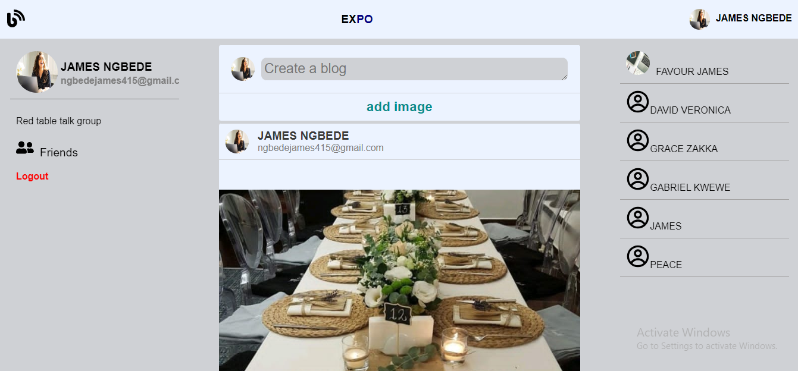
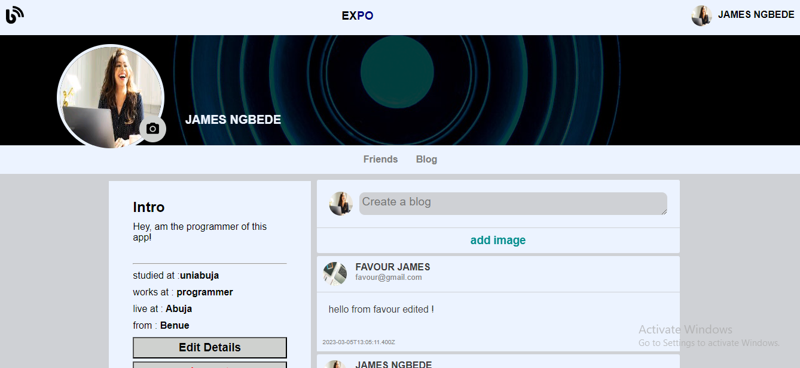

# MySocial - A Personal Social Media Web Application

Welcome to MySocial, a personal social media web application project! MySocial is built using React.js, Node.js, Express.js, and MongoDB. It provides users with a platform to connect, share thoughts, and engage in meaningful conversations.

## Table of Contents

- [Project Overview](#project-overview)
- [Features](#features)
- [Technologies Used](#technologies-used)
- [Getting Started](#getting-started)
- [Usage](#usage)
- [Contributing](#contributing)

## Project Overview

MySocial is a personal project developed with the aim of showcasing my skills in full-stack web development. It combines frontend and backend technologies to create a social media platform that allows users to interact, post content, and customize their profiles. The project focuses on implementing key features such as user authentication, post creation and editing, profile customization, and secure data storage.

## Features

- **User Authentication:** MySocial incorporates user authentication using JSON Web Tokens (JWT), ensuring secure access to user accounts and protecting sensitive data.

- **Post Creation and Editing:** Users can create posts and share their thoughts, experiences, or any content they wish to share. The application allows post editing to refine and improve the content even after it has been shared.

- **Profile Customization:** Users can personalize their profiles by adding profile pictures, biographies, and additional information. This allows them to showcase their identity and interests to the community.
  

## Technologies Used

The following technologies were used in the development of MySocial:

- Frontend:

  - React.js
  - JavaScript
  - HTML
  - CSS

- Backend:
  - Node.js
  - Express.js
  - MongoDB
  - JSON Web Tokens (JWT)

## Getting Started

This application is live on render.com

[link](https://blog-app-client-73he.onrender.com)

## Usage

- Upon accessing the application, users can sign up for a new account or log in if they already have an existing account.

- Once logged in, users can create posts, edit their posts, and customize their profiles. They can also view and interact with posts from other users.

## Contributing

Contributions to MySocial are currently not open. This project serves as a personal showcase of my skills and accomplishments in web development.

However, feedback and suggestions are always welcome! If you have any feedback or ideas for improvement, please feel free to reach out.

---

Thank you for checking out MySocial! This project reflects my passion for web development and demonstrates my proficiency in building full-stack applications. If you have any questions or would like to discuss collaboration opportunities, please
